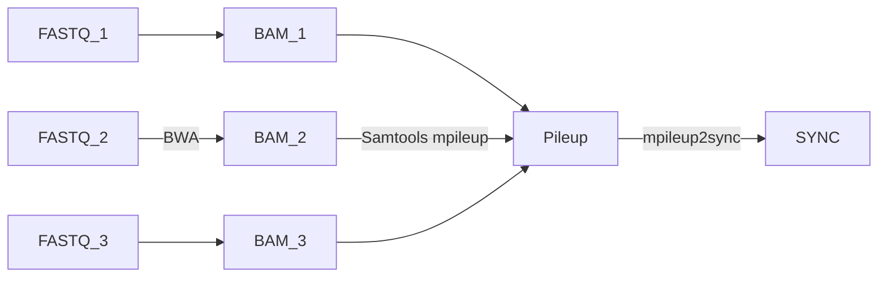

# phylogenetic-forests
Various scripts used in the genomic analyses carried out in Richardson et. al (2024). 

## Mapping and Pileup of samples
The basic pipeline for preparing data for analysis is as follows:

### Map reads using BWA-MEM:

    source bwa-0.7.17

    # reference genome
    ref=Am_2019.fasta

    # FASTQ paths
    filepath_f1=$1
    filepath_r2=$2
    in_file_f1=$(basename $filepath_f1)
    in_file_r2=$(basename $filepath_r2)

    outfile=$(echo $in_file_f1 | cut -f 1 -d "." )

    # -M for Picard compatibility
    # -t threads
    # -R Complete read group header line

    EX_READ=$(zcat $in_dir/$in_filepath_f1 | head -n 1)
    ID=$(echo $EX_READ | cut -f3 -d ":")
    FL=$(echo $EX_READ | cut -f4 -d ":")
    RL=$(echo $EX_READ | cut -f10 -d ":")

    bwa mem -M -t 8 -R "@RG\tID:${ID}.LANE${FL}\tSM:${outfile}\tLB:${outfile}\tPL:ILLUMINA\tPU:${ID}.${FL}.${RL}" $ref $in_dir/$filepath_f1 $in_dir/$filepath_r2 > $AlignmentsDir/$outfile.bwa.sam

### Sort SAM files and convert to BAM

    source samtools-1.7

    filepath=$AlignmentsDir/$outfile.bwa.sam

    samtools sort -@ 8 -o $AlignmentsDir/$outfile.bwa.sorted.bam $filepath

### Remove PCR duplicates and carry out local realignment around indels

    source jre-7.21

    ref=Am_2019.fasta 
    pic_path=/picard/1.134/x86_64/jars/
    GATK_path=/GATK/3.5.0/x86_64/jars/

    filepath=$AlignmentsDir/$outfile.bwa.sorted.bam

    #Index sorted bamfile
    samtools index $filepath

    #remove PCR duplicates
    java -Xmx16g -jar ${pic_path}/picard.jar MarkDuplicates REMOVE_DUPLICATES=true ASSUME_SORTED=true VALIDATION_STRINGENCY=SILENT MAX_FILE_HANDLES_FOR_READ_ENDS_MAP=900 TMP_DIR=/tmp INPUT=$filepath OUTPUT=${AlignmentsDir}/${outfile}.bwa.sorted.rmdup.bam  METRICS_FILE=${AlignmentsDir}/${outfile}.bwa.sorted.rmdup.metrics

    samtools index ${AlignmentsDir}/${outfile}.bwa.sorted.rmdup.bam

    #local realignment around indels
    java -Xmx16g -jar ${GATK_path}/GenomeAnalysisTK.jar -T RealignerTargetCreator -R ${ref} -I ${AlignmentsDir}/${outfile}.bwa.sorted.rmdup.bam -o ${AlignmentsDir}/${outfile}.bwa.sorted.rmdup.realign.intervals

    java -Xmx16g -jar  ${GATK_path}/GenomeAnalysisTK.jar -T IndelRealigner -R ${ref}  -targetIntervals ${AlignmentsDir}/${outfile}.bwa.sorted.rmdup.realign.intervals -I ${AlignmentsDir}/${outfile}.bwa.sorted.rmdup.bam --out ${AlignmentsDir}/${outfile}.bwa.sorted.rmdup.realign.bam

    samtools index ${AlignmentsDir}/${outfile}.bwa.sorted.rmdup.realign.bam

### Create Pileup of BAM files

    source samtools-1.7

    samtools mpileup 

#### Convert Pileup to Popoolation2 SYNC file

See https://github.com/popgenvienna/popoolation2/blob/master/mpileup2sync.jar

    source jre-7.21

    java mpileup2sync.jar

The output SYNC file is used for treeXY analysis (https://github.com/DR-Antirrhinum/treeXY)

## Generating genetic distance trees from treeXY output files

