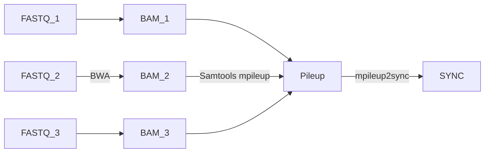

# phylogenetic-forests
Various scripts used in the genomic analyses carried out in Richardson _et. al_ (preprint available at https://www.biorxiv.org/content/10.1101/2025.02.12.637406v1). 

```geojson 
{ "type": "FeatureCollection",
    "features": [
      { "type": "Feature",
        "geometry": {"type": "Point", "coordinates": [1.772739, 42.763361]},
        "properties": {"population_name": "UNA"}
      },
      { "type": "Feature",
        "geometry": {"type": "Point", "coordinates": [1.568953, 42.869186]},
        "properties": {"population_name": "BED"}
      },
      { "type": "Feature",
        "geometry": {"type": "Point", "coordinates": [2.260464, 42.968486]},
        "properties": {"population_name": "LU"}
      },
      { "type": "Feature",
        "geometry": {"type": "Point", "coordinates": [2.2231055, 42.798143]},
        "properties": {"population_name": "AXA"}
      },
      { "type": "Feature",
        "geometry": {"type": "Point", "coordinates": [2.039864, 42.725164]},
        "properties": {"population_name": "MIJ"}
      },
      { "type": "Feature",
        "geometry": {"type": "Point", "coordinates": [2.122297, 42.507878]},
        "properties": {"population_name": "MON"}
      },
      { "type": "Feature",
        "geometry": {"type": "Point", "coordinates": [2.8552415, 42.467675]},
        "properties": {"population_name": "PER"}
      },
      { "type": "Feature",
        "geometry": {"type": "Point", "coordinates": [2.58705, 42.643378]},
        "properties": {"population_name": "BOU"}
      },
      { "type": "Feature",
        "geometry": {"type": "Point", "coordinates": [2.367453, 42.587006]},
        "properties": {"population_name": "VIL"}
      },
      { "type": "Feature",
        "geometry": {"type": "Point", "coordinates": [2.4876195, 42.3895975]},
        "properties": {"population_name": "ARS"}
      },
      { "type": "Feature",
        "geometry": {"type": "Point", "coordinates": [2.721694, 42.644139]},
        "properties": {"population_name": "THU"}
      },
      { "type": "Feature",
        "geometry": {"type": "Point", "coordinates": [3.124183, 42.489458]},
        "properties": {"population_name": "BAN"}
      },
      { "type": "Feature",
        "geometry": {"type": "Point", "coordinates": [2.6084845, 42.4479485]},
        "properties": {"population_name": "ARL"}
      },
      { "type": "Feature",
        "geometry": {"type": "Point", "coordinates": [1.533579, 43.311569]},
        "properties": {"population_name": "CIN"}
      },
      { "type": "Feature",
        "geometry": {"type": "Point", "coordinates": [2.052929, 42.326943]},
        "properties": {"population_name": "YP1"}
      },
      { "type": "Feature",
        "geometry": {"type": "Point", "coordinates": [1.926958, 42.359921]},
        "properties": {"population_name": "YP4"}
      },
      { "type": "Feature",
        "geometry": {"type": "Point", "coordinates": [2.091375, 42.322234]},
        "properties": {"population_name": "MP4"}
      },
      { "type": "Feature",
        "geometry": {"type": "Point", "coordinates": [2.170284, 42.331038]},
        "properties": {"population_name": "MP11"}
      }
   ]
}
```
18 geographically dispersed populations of _Antirrhinum majus majus var. pseudomajus_ and _A. m. m. var. striatum_ were sampled, sequenced, and mapped to the *Antirrhinum majus* reference genome V3 (https://ngdc.cncb.ac.cn/gwh/Assembly/25982/show). Pool-seq data will soon be available from SRA, under BioProject PRJNA1232105.

## Mapping and Pileup of samples
The basic pipeline for preparing data for analysis is as follows:


### Map reads using BWA-MEM:

    source bwa-0.7.17

    # reference genome
    ref=Am_2019.fasta

    # FASTQ paths
    filepath_f1=$1
    filepath_r2=$2
    in_file_f1=$(basename $filepath_f1)
    in_file_r2=$(basename $filepath_r2)

    outfile=$(echo $in_file_f1 | cut -f 1 -d "." )

    # -M for Picard compatibility
    # -t threads
    # -R Complete read group header line

    EX_READ=$(zcat $in_dir/$in_filepath_f1 | head -n 1)
    ID=$(echo $EX_READ | cut -f3 -d ":")
    FL=$(echo $EX_READ | cut -f4 -d ":")
    RL=$(echo $EX_READ | cut -f10 -d ":")

    bwa mem -M -t 8 -R "@RG\tID:${ID}.LANE${FL}\tSM:${outfile}\tLB:${outfile}\tPL:ILLUMINA\tPU:${ID}.${FL}.${RL}" $ref $in_dir/$filepath_f1 $in_dir/$filepath_r2 > $AlignmentsDir/$outfile.bwa.sam

### Sort SAM files and convert to BAM

    source samtools-1.7

    filepath=$AlignmentsDir/$outfile.bwa.sam

    samtools sort -@ 8 -o $AlignmentsDir/$outfile.bwa.sorted.bam $filepath

### Remove PCR duplicates and carry out local realignment around indels

    source jre-7.21

    ref=Am_2019.fasta 
    pic_path=/picard/1.134/x86_64/jars/
    GATK_path=/GATK/3.5.0/x86_64/jars/

    filepath=$AlignmentsDir/$outfile.bwa.sorted.bam

    #Index sorted bamfile
    samtools index $filepath

    #remove PCR duplicates
    java -Xmx16g -jar ${pic_path}/picard.jar MarkDuplicates REMOVE_DUPLICATES=true ASSUME_SORTED=true VALIDATION_STRINGENCY=SILENT MAX_FILE_HANDLES_FOR_READ_ENDS_MAP=900 TMP_DIR=/tmp INPUT=$filepath OUTPUT=${AlignmentsDir}/${outfile}.bwa.sorted.rmdup.bam  METRICS_FILE=${AlignmentsDir}/${outfile}.bwa.sorted.rmdup.metrics

    samtools index ${AlignmentsDir}/${outfile}.bwa.sorted.rmdup.bam

    #local realignment around indels
    java -Xmx16g -jar ${GATK_path}/GenomeAnalysisTK.jar -T RealignerTargetCreator -R ${ref} -I ${AlignmentsDir}/${outfile}.bwa.sorted.rmdup.bam -o ${AlignmentsDir}/${outfile}.bwa.sorted.rmdup.realign.intervals

    java -Xmx16g -jar  ${GATK_path}/GenomeAnalysisTK.jar -T IndelRealigner -R ${ref}  -targetIntervals ${AlignmentsDir}/${outfile}.bwa.sorted.rmdup.realign.intervals -I ${AlignmentsDir}/${outfile}.bwa.sorted.rmdup.bam --out ${AlignmentsDir}/${outfile}.bwa.sorted.rmdup.realign.bam

    samtools index ${AlignmentsDir}/${outfile}.bwa.sorted.rmdup.realign.bam

### Create Pileup of BAM files for one chromosome / scaffold

    source samtools-1.7

    ref=Am_2019.fasta 

    # -q and -Q are read and mapping qualities
    # -t DP to output per-sample read depth
    # -B to disable probabilistic realignment for the computation of base alignment quality (Phred-scaled probability of a read base being misaligned)
    # -A to count orphans (anomalous read pairs in variant calling) 
    # use -r to specify a chromosome / scaffold and submit each separately.

    inChr=$1

    samtools mpileup  -q 40 -Q 30 -t DP -BA -f $ref -r ${inChr} Sample_1.bam Sample_2.bam Sample_n.bam > ${inChr}.pileup


#### Convert Pileup to Popoolation2 SYNC file

See https://github.com/popgenvienna/popoolation2/blob/master/mpileup2sync.jar

    source jre-7.21

    java -Xmx16g -jar mpileup2sync.jar --input ${inChr}.pileup --output ${inChr}.sync --min-qual 30 --threads 1

The output SYNC file is used for treeXY analysis (https://github.com/DR-Antirrhinum/treeXY)

## Generating genetic distance trees from treeXY output files

See _grouping_tree_scan.R_

## Simulating a selective sweep on whole chromosome data

See _artificial_sweep.py_

## Generate whole genome trees with _d<sub>XY</sub>_ and _D_

First, download treeXY, and copy treeXY_mean.py into the same directory (treeXY_funcs.py is required to run). Then, run treeXY_mean.py on the SYNC files of all the chromosomes you wish to analyse. Finally, use _WG_dXY_D_trees.R_ to read and generate mean _d<sub>XY</sub>_ and _D_ trees for the whole genome.

## Generate whole genome Maximum Likelihood tree from SYNC files

First, run treeXY with _--write-sync_ enabled to generate treeXY_filtered SYNC files. Next, generate consensus FASTA files for each SYNC file using _consensus_from_sync.py_. Each consensus FASTA file will contain one sequence for each taxon in the SYNC file.

To merge results from different chromosomes, and generate a whole genome consensus FASTA file, you can use _paste_ from the command line. It's also useful to use _fold_ to spread the merged FASTA sequence across multiple rows, and _sed -i_ to edit labels. The resultant whole genome FASTA file can then serve as the input for your phylogenetic software of choice, such as RAxML-NG (Kozlov _et al._, 2019):

    raxml-ng --all --msa WG_treeXY_filtered.fa --model GTR+G --tree pars{10} --bs-trees 100

## Calculating shortest root branch and the cophenetic correlation coefficient for hierarchical clustering trees

See _grouping_tree_scan.R_

## Grouping hierarchical clustering trees based on root division

See _grouping_tree_scan.R_
